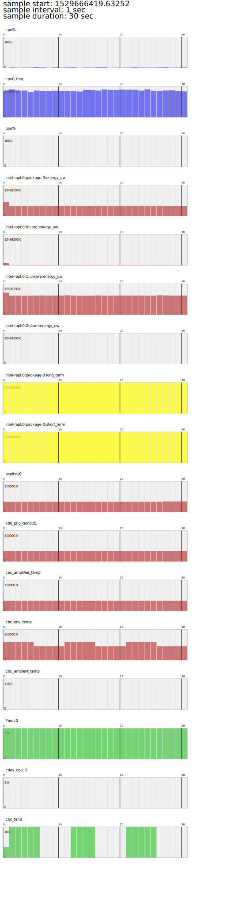
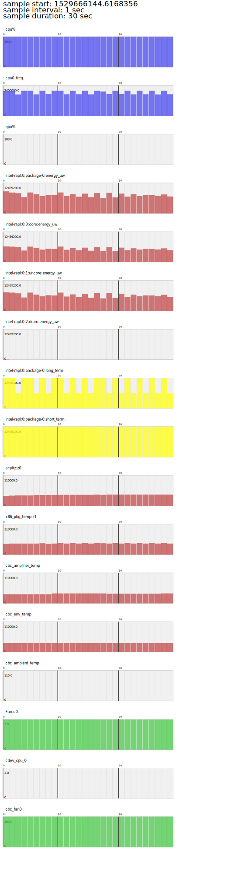

# APL Thermal User Guide

## Introduction
The generic thermal sysfs provides a set of interfaces for thermal zone devices (sensors) and thermal cooling devices (fan, processor...).
On APL, it has CBC Thermal utility, which provides interfaces to access temperature sensors and cooling devices on IO Controller.
This how-to focuses on enabling intel thermal daemon for APL thermal management.

### Thermal Zones
Thermal zone, by definition, not only gives the temperature reading of a thermal sensor, but also binding cooling devices associated with trip points.
### Thermal sensors
Thermal sensor is used to take temperature measurements for specific thermal zone.
### Cooling devices
Cooling device is used to dissipate heat for specific thermal zone.
### Trip points
Trip point describes key temperatures at which cooling is recommended.
### Sysfs I/F
```
/sys/class/thermal/thermal_zone[0-*]:
    |---type:			Type of the thermal zone
    |---temp:			Current temperature
    |---trip_point_[0-*]_temp:	Trip point temperature
    |---trip_point_[0-*]_type:	Trip point type
    |---cdev[0-*]:		[0-*]th cooling device in current thermal zone
    |---cdev[0-*]_trip_point:	Trip point that cdev[0-*] is associated with

/sys/class/thermal/cooling_device[0-*]:
    |---type:			Type of the cooling device(processor/fan/...)
    |---max_state:		Maximum cooling state of the cooling device
    |---cur_state:		Current cooling state of the cooling device
```
### Thermal daemon
Thermald is a Linux daemon used to prevent the overheating of platforms before HW takes aggressive correction action.
Thermal daemon looks for thermal sensors, thermal cooling devices and trip points in the linux thermal sysfs and builds a list of sensors, cooling devices and trip points. Each of the thermal sensors can optionally be binded to a cooling device. In this case, thermald can take actions based on the trip points for each sensor and associate cooling device.
Thermal daemon allows users to change this relationship or add new one via a thermal configuration file (thermal-conf.xml).

```
                       Thermal management architecture

 +-----------------------------------------------------------------------------+
 |                           Thermal Daemon                                    |
 +-----------------------------------------------------------------------------+
                                    ^
                                    |
USER SPACE                          |
 ~~~~~~~~~~~~~~~~~~~~~~~~~~~~~~~~~~~|~~~~~~~~~~~~~~~~~~~~~~~~~~~~~~~~~~~~~~~~~~
                                    |
                                    |
KERNEL SPACE                        v
 +-----------------------------------------------------------------------------+
 |                               sysfs I/F                                     |
 +-----------------------------------------------------------------------------+
         ^                                       ^
         |                                       |
         |                                       |
         v                                       v
 +-----------------+     +-------------+   +-------------+
 | thermal drivers |<--->| cpu drivers |   | RAPL drivers|     ... ...
 +-----------------+     +-------------+   +-------------+
         ^                     ^                 ^
         |                     |                 |
         |                     |                 |
         v                     v                 v
 +-----------------------------------------------------------------------------+
 |                      Platform hardware, BIOS, Firmware                      |
 +-----------------------------------------------------------------------------+
```

## APL Thermals
### acpitz
ACPI thermal zone, which is provided by ACPI thermal table. ACPI always assumes that the CPU is the major thermal contributor and Processor/Fan are the major cooling devices. ACPI also defines serveral trip points. Thermal daemon will scan it from below sysfs I/F:

```
/sys/class/thermal/thermal_zone0/type
/sys/class/thermal/thermal_zone0/temp
/sys/class/thermal/thermal_zone0/cdev*
/sys/class/thermal/thermal_zone0/trip_point_*
...
```
### Fan cooling devices
The ACPI fan driver supports only two cooling states: state 0 means the fan is off, state 1 means the fan is on. Normally, it will be used by acpitz. Thermal daemon will scan it from below sysfs I/F:
```
/sys/class/thermal/cooling_device0/type
/sys/class/thermal/cooling_device0/max_state
/sys/class/thermal/cooling_device0/cur_state
...
```
### Processor cooling devices
ACPI processor cooling state is a combination of the processor P-state and T-state. The ACPI CPU frequency driver prefers to reduce the frequency first, and then to throttle. Normally, processor cooling devices will be used by acpitz. Thermal daemon will scan it from below sysfs I/F:
```
/sys/class/thermal/cooling_device[1-cpunum]/type
/sys/class/thermal/cooling_device[1-cpunum]/max_state
/sys/class/thermal/cooling_device[1-cpunum]/cur_state
...
```
### RAPL cooling devices
RAPL (Running Average Power Limit) provides a way to set power limits on processor packages and DRAM. It can dynamically limit max average power to to match its expected power and cooling budget.  
Normally, rapl_controller is the default cooling device for x86 package-0.
### x86_pkg_temp
Each x86 package will register as a thermal zone under /sys/class/thermal. By default, it has no cooling device and trip point enabled. User can define trip point in thermald config file to use it.
### cbc_env_temp
This thermal sensor is provided by IOC with CBC protocol. The temperature value can be read from /run/cbc_thermal/cbc_env_temp.
### cbc_amplifier_temp
This thermal sensor is provided by IOC with CBC protocol. The temperature value can be read from /run/cbc_thermal/cbc_amplifier_temp
### cbc_ambient_temp
This thermal sensor is provided by IOC with CBC protocol. The temperature value can be read from /run/cbc_thermal/cbc_ambient_temp
### CBC cooling devices
### cbc_fan0
This cooling device is provided by IOC with CBC protocol. The fun duty cycle [0-100] can be read/written from/to /run/cbc_thermal/cbc_fan0
## Customization
### Config file
The thermal daemon configuration file format conforms to XML specifications. A set of tags defined to define sensors, zones, cooling devices and trip points. The default config file is /etc/ioc-cbc-tools/thermal-conf.xml 
### User defined sensor
User can define a new sensor with "Type" and "Path". Thermal daemon will add this sensor into sensors list and poll the temperature valure from "Path".
E.g.
```
	<ThermalSensors>
		<ThermalSensor>
			<Type>cbc_env_temp</Type>
			<Path>/run/cbc_thermal/cbc_env_temp</Path>
		</ThermalSensor>
	</ThermalSensors>
```
### User defined cooling device
User can define a new cooling device with "Type", "Path", "MinState", "MaxState" and "IncDecStep". Thermal daemon will add this cooling device into cooling devices list and use min/max and step size to cool the system.
E.g.
```
	<CoolingDevices>
		<CoolingDevice>
			<Path>/run/cbc_thermal/cbc_fan0</Path>
			<Type>cbc_fan0</Type>
			<MinState>0</MinState>
			<IncDecStep>10</IncDecStep>
			<MaxState>100</MaxState>
		</CoolingDevice>
	</CoolingDevices>
```
### User defined trip point
User can define a new trip point with "SensorType", "Temperature", "type" and "CoolingDevice". Thermal daemon will add this trip point into trip points. The temperature is read from a matched sensor and compared with the temperature defined by trip point. When a trip point temperature is violated, the cooling device will be activated. If the "type" of trip point is "critical", the cooling action is to reboot system for HW protection.
E.g.
```
	<TripPoint>
		<SensorType>cbc_env_temp</SensorType>
		<Temperature>60000</Temperature>
		<type>passive</type>
		<CoolingDevice>
			<Type>cbc_fan0</Type>
			<TargetState>100</TargetState>
		</CoolingDevice>
	</TripPoint>
```
```
	<TripPoint>
		<SensorType>cbc_env_temp</SensorType>
		<Temperature>100000</Temperature>
		<type>critical</type>
	</TripPoint>
```
### User defined thermal zone
User can define a thermal zone which includes all trip points belong to this zone.
```
	<ThermalZone>
		<Type>CBC_ENV</Type>
		<TripPoints>
			<TripPoint>
				...
			</TripPoints>
			<TripPoint>
				...
			</TripPoints>
				...
		</TripPoints>
	</ThermalZone>
```
## Practices
### Use cbc_fan0 to keep the temperature of cbc_env_temp
The default config file (/etc/ioc-cbc-tools/thermal-conf.xml) has a trip point for cbc_env_temp. If the temperature is violated, it will set cbc_fan0 duty cycle to 100.

CBC Thermal has debug interface to set sensor value manually. We can use this debug interface to try this trip tpoint quickly.
```
cbc_thermal_chart.py --time 30 &
echo -n 0 > /run/cbc_thermal/auto_update
for i in {1..3}; do
        echo -n 65000 > /run/cbc_thermal/cbc_env_temp
        sleep 5
        echo -n 50000 > /run/cbc_thermal/cbc_env_temp
        sleep 5
done
echo -n 1 > /run/cbc_thermal/auto_update
wait $(jobs -rp)
```
The thermal chart can be find in /run/log/cbc_thermal_chart-*.svg. It shows the cbc_fan0 duty cycle is changed based on cbc_env_temp.

[](test/cbc_thermal_chart-sample0.svg?sanitize=true)
### Use RAPL to limit package power
Keep CPU idle and get package temperature.
```
cat /sys/class/thermal/thermal_zone1/temp
```
Suppose the idle temperature is T_idle = 34000

Let CPU be busy and get package temperature.
```
yes > /dev/null &
yes > /dev/null &
yes > /dev/null &
yes > /dev/null &
sleep 10
cat /sys/class/thermal/thermal_zone1/temp
killall yes
```
Suppose the busy temperature is T_busy = 50000.

Get package-0 long term constraint max value.
```
cat /sys/class/powercap/intel-rapl:0/constraint_0_max_power_uw
```
Suppose the max value is 12499200.

Suppose we want keep the package temperature below 41000. And we can limit package RAPL to half of max for cooling.

Add test thermal zone in config file (/etc/ioc-cbc-tools/thermal-conf.xml)
```
	<ThermalZone>
		<Type>test</Type>
		<TripPoints>
			<TripPoint>
				<SensorType>x86_pkg_temp</SensorType>
				<Temperature>41000</Temperature>
				<type>passive</type>
				<CoolingDevice>
					<Type>rapl_controller</Type>
					<TargetState>6249600</TargetState>
				</CoolingDevice>
			</TripPoint>
		</TripPoints>
	</ThermalZone>

```
Restart the cbc_thermald service and wait it ready.
```
systemctl restart cbc_thermald
sleep 10
```
Start the test and use thermal chart tool to collect data.
```
yes > /dev/null &
yes > /dev/null &
yes > /dev/null &
yes > /dev/null &
cbc_thermal_chart.py --time 30
killall yes
```
The thermal chart can be find in /run/log/cbc_thermal_chart-*.svg. It shows the cpufreq will be impacted by RAPl and x86_pkg_temp is around 41000.

[](test/cbc_thermal_chart-sample1.svg?sanitize=true)

### Reboot system if temperature is too high
The default config has a trip point to reboot system while cbc_env_temp reach 100. We can trigger this trip point manually with debug interface.
```
echo -n 0 > /run/cbc_thermal/auto_update
echo -n 100 > /run/cbc_thermal/cbc_env_temp
```
